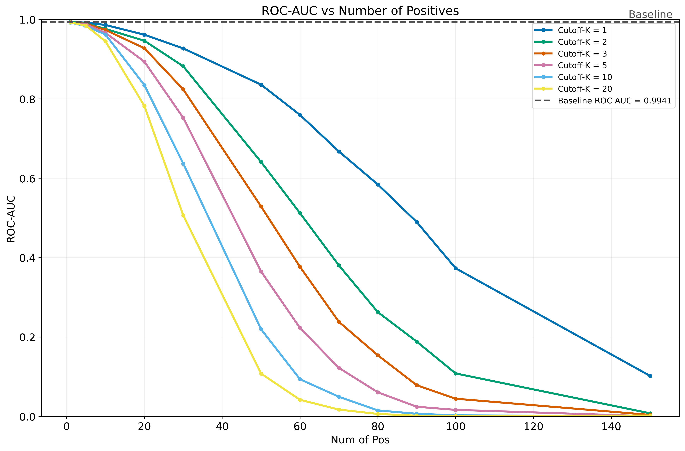

# Fast-DetectGPT
**This code is for ICLR 2024 paper "Fast-DetectGPT: Efficient Zero-Shot Detection of Machine-Generated Text via Conditional Probability Curvature"**, where we borrow or extend some code from [DetectGPT](https://github.com/eric-mitchell/detect-gpt).

[Paper](https://arxiv.org/abs/2310.05130) 
| [LocalDemo](#local-demo)
| [OnlineDemo](https://fastdetect.net/)
| [OpenReview](https://openreview.net/forum?id=Bpcgcr8E8Z)

* 9/13/2025: We have recover the demo at https://fastdetect.net.
* :fire: API support is launched. Please check the [API page](https://fastdetect.net/#/apidoc) in the demo.
* :fire: Fast-DetectGPT can utilize GPT-3.5 and other proprietary models as its scoring model now via [Glimpse](https://github.com/baoguangsheng/glimpse).
* :fire: So far the best sampling/scoring models we found for Fast-DetectGPT are falcon-7b/falcon-7b-instruct.

## Brief Intro
<table class="tg"  style="padding-left: 30px;">
  <tr>
    <th class="tg-0pky">Method</th>
    <th class="tg-0pky">5-Model Generations ↑</th>
    <th class="tg-0pky">ChatGPT/GPT-4 Generations ↑</th>
    <th class="tg-0pky">Speedup ↑</th>
  </tr>
  <tr>
    <td class="tg-0pky">DetectGPT</td>
    <td class="tg-0pky">0.9554</td>
    <td class="tg-0pky">0.7225</td>
    <td class="tg-0pky">1x</td>
  </tr>
  <tr>
    <td class="tg-0pky">Fast-DetectGPT</td>
    <td class="tg-0pky">0.9887 (relative↑ <b>74.7%</b>)</td>
    <td class="tg-0pky">0.9338 (relative↑ <b>76.1%</b>)</td>
    <td class="tg-0pky"><b>340x</b></td>
  </tr>
</table>
The table shows detection accuracy (measured in AUROC) and computational speedup for machine-generated text detection. The <b>white-box setting</b> (directly using the source model) is used for detecting generations produced by five source models (5-model), whereas the <b>black-box
setting</b> (utilizing surrogate models) targets ChatGPT and GPT-4 generations. AUROC results are averaged across various datasets and source models. Speedup assessments were conducted on a Tesla A100 GPU.


## Environment
* Python3.8
* PyTorch1.10.0
* Setup the environment:
  ```bash setup.sh```
  
(Notes: our experiments are run on 1 GPU of Tesla A100 with 80G memory.)

## Local Demo
Please run following command locally for an interactive demo:
```
python scripts/local_infer.py
```
where the default sampling and scoring models are both gpt-neo-2.7B.

We could use gpt-j-6B as the sampling model to obtain more accurate detections:
```
python scripts/local_infer.py  --sampling_model_name gpt-j-6B
```


An example (using gpt-j-6B as the sampling model) looks like
```
Please enter your text: (Press Enter twice to start processing)
Disguised as police, they broke through a fence on Monday evening and broke into the cargo of a Swiss-bound plane to take the valuable items. The audacious heist occurred at an airport in a small European country, leaving authorities baffled and airline officials in shock.

Fast-DetectGPT criterion is 1.9299, suggesting that the text has a probability of 82% to be machine-generated.
```

## Workspace
Following folders are created for our experiments:
* ./exp_main -> experiments for 5-model generations (main.sh).
* ./exp_gpt3to4 -> experiments for GPT-3, ChatGPT, and GPT-4 generations (gpt3to4.sh).

(Notes: we share <b>generations from GPT-3, ChatGPT, and GPT-4</b> in exp_gpt3to4/data for convenient reproduction.)

## Extensions to Fast-DetectGPT

This repository includes two independent research extensions to the original Fast-DetectGPT work:

---

### 🎯 Extension 1: Mid-K Adversarial Attack (GPT-2 + XSum)

We implement and extensively evaluate the **Mid-K adversarial attack** - a novel perturbation method that tests the robustness of AI text detectors by forcing language models to avoid their most confident token choices during generation.

**Mid-K Attack Mechanism:**
The attack works by strategically disrupting the generation process:
1. **Token Banning**: At selected positions, set logits of top-K most probable tokens to -∞
2. **Forced Sampling**: Model must sample from remaining, less probable alternatives
3. **Controlled Perturbation**: Systematically vary attack strength via parameters

**Attack Parameters:**
- **P** (Position): Number of positions per sequence where ban is applied
- **K** (Cutoff): Number of top tokens to exclude at each position  
- **S** (Start): First token index eligible for perturbation (fixed at 5)

**Comprehensive Parameter Grid:**
- **Position values**: `{1, 5, 10, 20, 30, 50, 60, 70, 80, 90, 100, 150}` (12 values)
- **Cutoff-K values**: `{1, 3, 5, 10, 20}` (5 values)
- **Total combinations**: **60 attack configurations**

**Implementation Details:**
- Integrated into data generation pipeline (`scripts/data_builder.py`)
- Configurable via `pos` and `limit` parameters in dataset naming
- Detection pipeline remains unchanged for fair evaluation
- Applied during decoding only, not during detection

**Experimental Setup:**
```
Model: GPT-2
Dataset: XSum (English news summarization)
Configurations: 60 Mid-K attack variants (12 position × 5 cutoff-K)
Setting: Zero-shot detection with Fast-DetectGPT
```

**Research Question:**
- How does detection performance degrade under increasing Mid-K attack strength across a comprehensive parameter space?

**Detection Performance Results:**



*Figure: Mid-K attack effectiveness on Fast-DetectGPT detection of GPT-2 generated text (XSum dataset). ROC-AUC degrades as perturbation positions increase, with lower Cutoff-K values causing faster performance collapse.*

**Key Findings:**

1. **Baseline Performance**: The unperturbed baseline achieves ROC-AUC = 0.9941, confirming near-perfect detection capability without adversarial perturbations.

2. **Rapid Performance Degradation**: Detection performance steadily decreases as the number of perturbed positions (P) increases:
   - With **P=50, K=3**: ROC-AUC drops to **0.5287** (47% degradation)
   - With **P=60, K=2**: ROC-AUC falls to **0.512** (near-random detection)
   - These perturbations cause minimal visible changes to text quality

3. **Cutoff-K Impact**: Lower K values (forcing selection from fewer alternatives) result in more aggressive detector degradation:
   - **K=1**: Steepest decline, reaching near-random performance at ~150 positions
   - **K=20**: Gentler degradation, maintaining some detection signal even at high P values
   - Trade-off exists between attack strength and text naturalness

4. **Critical Vulnerability**: The detector's signal is highly sensitive to subtle sampling perturbations. Even when perturbed text remains fluent and coherent, strategic token selection disrupts the probability curvature patterns that Fast-DetectGPT relies upon.

5. **Attack Efficiency**: Moderate perturbation levels (P=30-60) with low-to-medium K values (K=2-5) achieve strong evasion while preserving text quality, representing an optimal balance for practical adversarial scenarios.

---

### 🌍 Extension 2: Cross-lingual Evaluation (New Models + XLSum Scottish Gaelic)

**Dataset Addition:**
- **XLSum Scottish Gaelic**: 1,313 BBC Alba news articles
- Adds a low-resource language to the evaluation

**Model Expansion:**
Three additional language models evaluated (without adversarial attacks):
1. **Deepseek-R1-distill-Llama-8B** (r1-8b)
2. **Phi-2** (2.7B parameters)
3. **Mistral-7B**

**Experimental Setup:**
```
Models: r1-8b, phi-2, mistral-7b
Dataset: XLSum (Scottish Gaelic)
Attack: None (baseline detection only)
Setting: Zero-shot detection
```

## Usage

**Analysis Pipeline:**
```bash
# Generate Mid-K perturbed data
python scripts/data_builder.py --dataset xsum --pos 10 --limit 5

# Evaluate detection robustness  
python scripts/fast_detect_gpt.py --dataset xsum --dataset_file data/xsum_pos10_limit5

# Analyze attack effectiveness
python scripts/mid_k_visualization.py results.csv
```

**Visualization:**
- `scripts/mid_k_visualization.py` - Attack effectiveness analysis
- ROC-AUC degradation plots across parameter space

### 🎓 Research Contributions

1. **Novel Adversarial Method**: Systematic evaluation of token-banning attacks on AI text detectors
2. **Comprehensive Parameter Study**: 60 attack configurations on GPT-2/XSum revealing robustness boundaries  
3. **Additional Models**: Evaluation on newer language models (r1-8b, phi-2, mistral-7b)
4. **Additional Dataset**: Scottish Gaelic language data from XLSum
5. **Reproducible Framework**: Complete pipeline for detection and adversarial evaluation

- Optimal attack parameters vary by model architecture and dataset characteristics
- Trade-offs exist between attack effectiveness and generated text quality

This Mid-K evaluation framework provides a foundation for future adversarial robustness research in multilingual AI text detection.

### Citation
If you find this work useful, you can cite it with the following BibTex entry:

    @inproceedings{bao2023fast,
      title={Fast-DetectGPT: Efficient Zero-Shot Detection of Machine-Generated Text via Conditional Probability Curvature},
      author={Bao, Guangsheng and Zhao, Yanbin and Teng, Zhiyang and Yang, Linyi and Zhang, Yue},
      booktitle={The Twelfth International Conference on Learning Representations},
      year={2023}
    }

